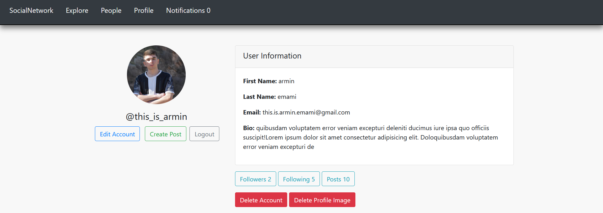
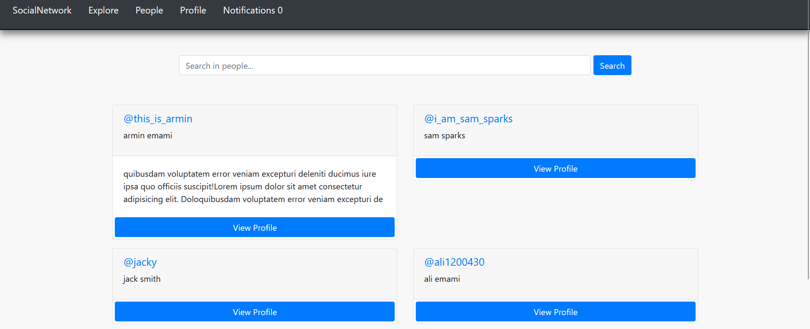
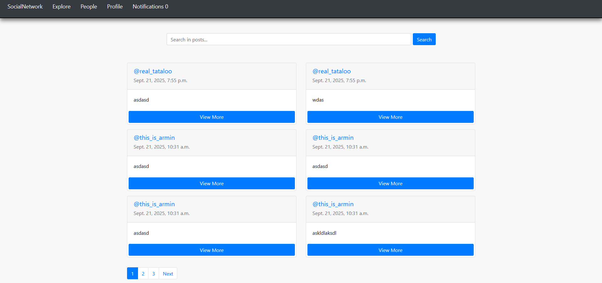
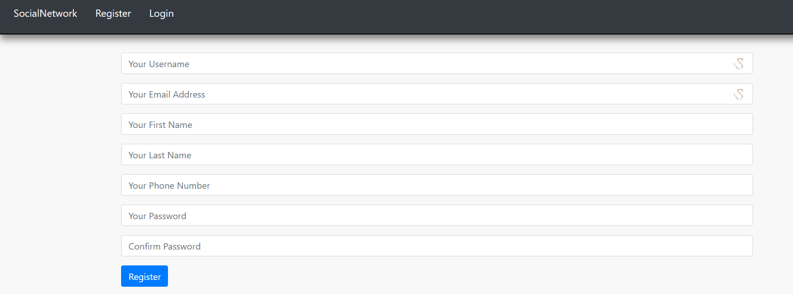

# Installing
### Run the following command:
    pip install -r requirements.txt

    python manage.py migrate
    
    python manage.py runserver

### Open browser and go to this address:

    localhost:8000

